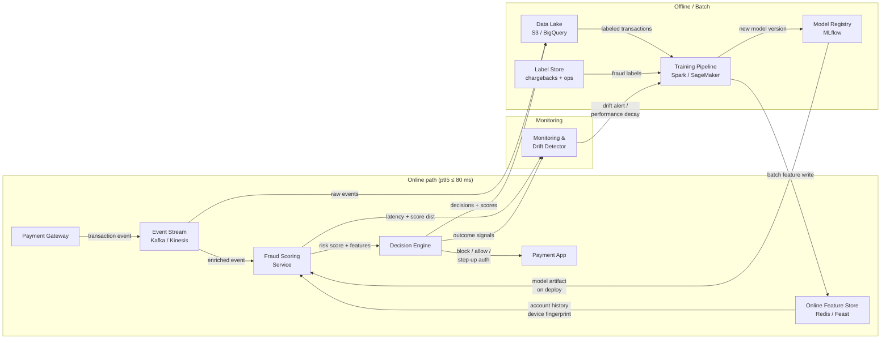

# Architecture — Real-time Fraud Scoring (Scenario A)



## Serving boundary

| Zone | Components |
|------|-----------|
| **Online** (synchronous, in payment path) | Payment Gateway → Event Stream → Fraud Scoring Service → Decision Engine → Payment App |
| **Online read** (sub-ms lookup) | Online Feature Store (serves account history & device fingerprint to the scoring service) |
| **Offline / Batch** | Data Lake, Label Store, Training Pipeline, Model Registry |
| **Async** | Monitoring & Drift Detector (reads scoring output out-of-band) |

## Key contracts

| Arrow | What flows |
|-------|-----------|
| PG → Event Stream | Transaction event (amount, merchant, timestamp, device ID, account ID) |
| Event Stream → Fraud Scoring Service | Enriched event (same + session metadata) |
| Online Feature Store → Fraud Scoring Service | Pre-materialized features (30-day spend velocity, device risk score, account age) |
| Fraud Scoring Service → Decision Engine | Risk score (0–1), feature vector, model version |
| Decision Engine → Payment App | Decision enum: `BLOCK` / `ALLOW` / `STEP_UP_AUTH` |
| Training Pipeline → Online Feature Store | Batch feature refresh (nightly) |
| Monitoring → Training Pipeline | Drift signal / performance-decay trigger |
```
